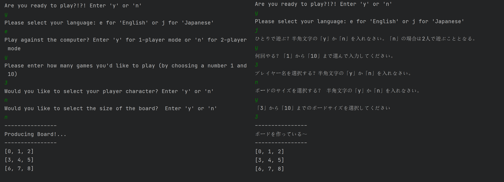
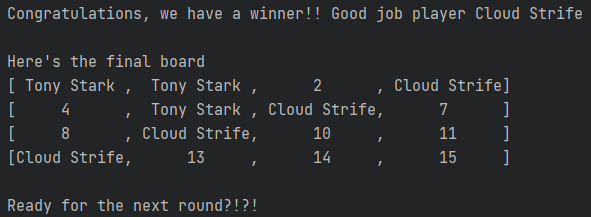

# tic-tac-toe
A little side project to pass the time

#### Background 
As interview practice one day, an engineer asked me to design a tic-tac-toe game. I was only able to implement a board and logic for processing a turn and checking for a winner. I decided to keep working on this as a project to get more familiar with building projects from scratch in Java

#### How it's played
*First, run the program! When the game starts up:*
- Players are prompted to begin the game
- Once they have selected yes, they have the ability to specify a variety of play options
- The first player to go is chosen randomly
- During their turn, players select a position on the board by selecting a number representing an open spot
- After each turn, a check is performed to see if there's a winner~
- If all spots are filled on the board and neither player has won, the game is a draw
- Depending on if there was a winner of the round or game, players can replay the game

#### Features Implemented
- 1-player (vs. computer) or 2-player mode
- i18n for Japanese

- Users can select player string (or default to 'x' and 'o') 

- Replay mechanic once game is over
- Selecting board size
- Best 'x' out of 'x' games (ex. keeping track of best 2 of 3)